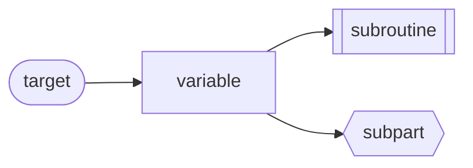
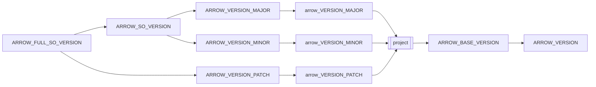
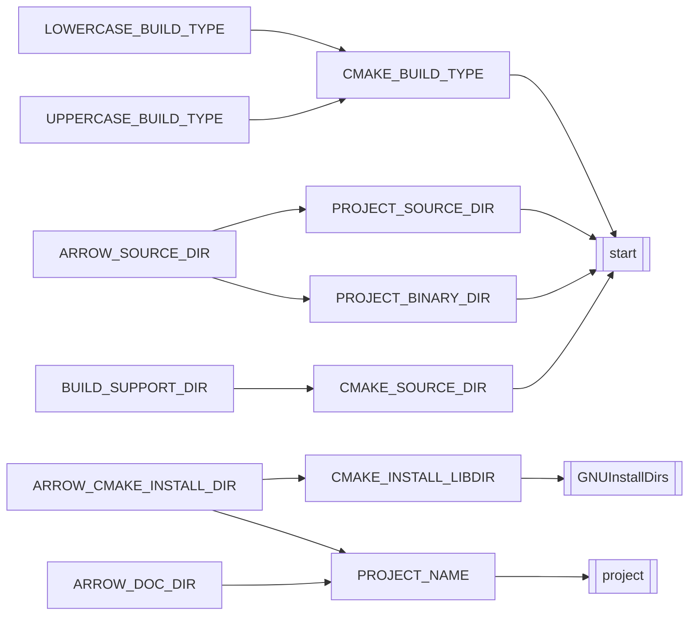
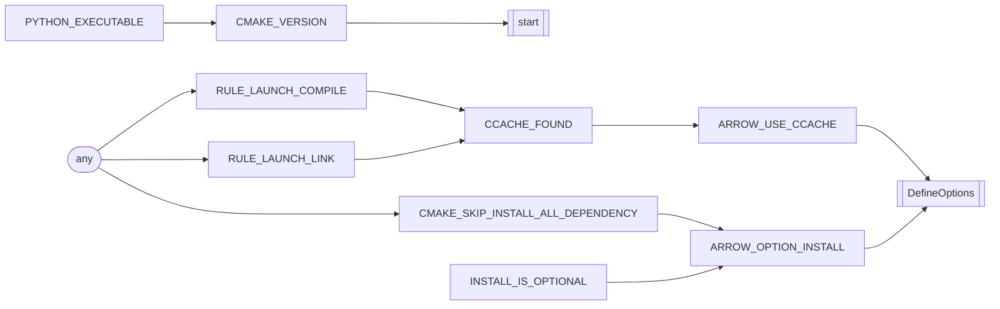
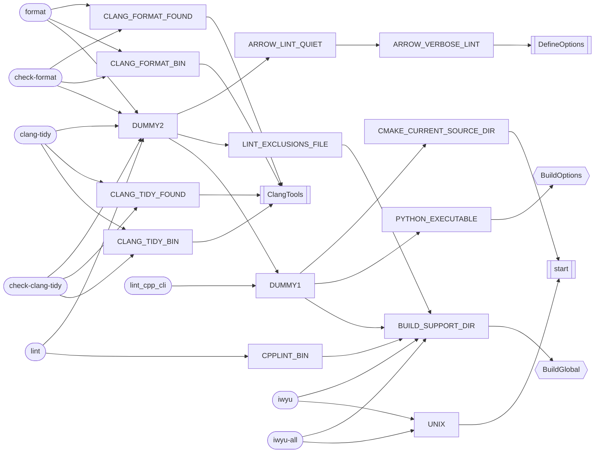
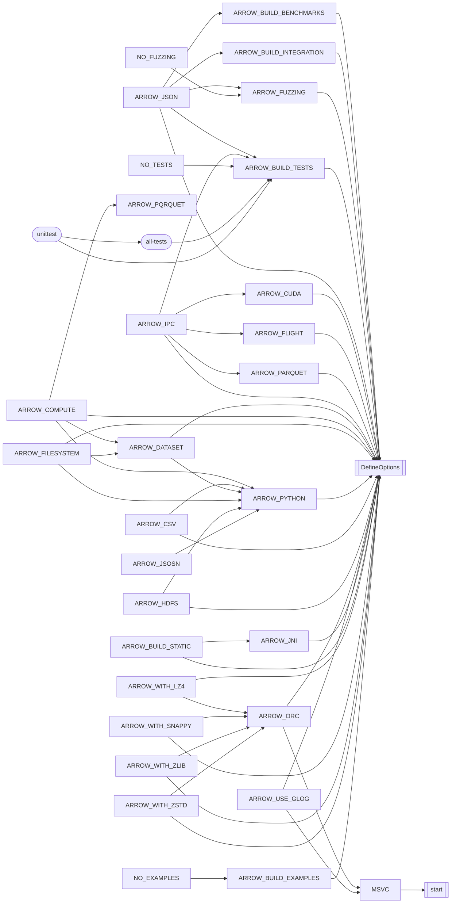
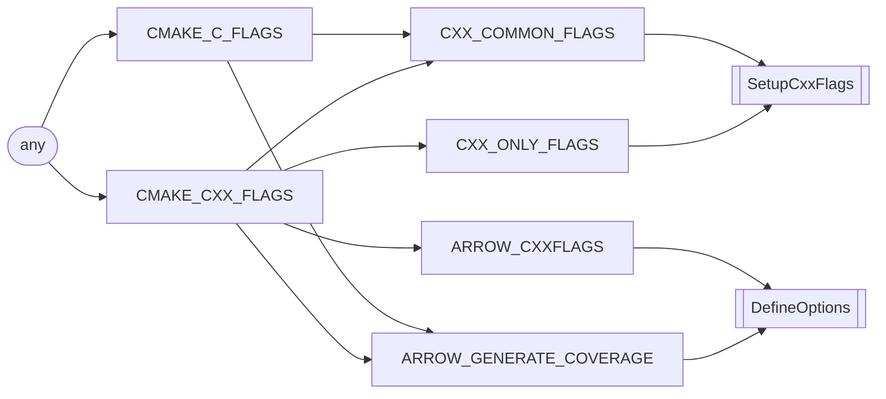
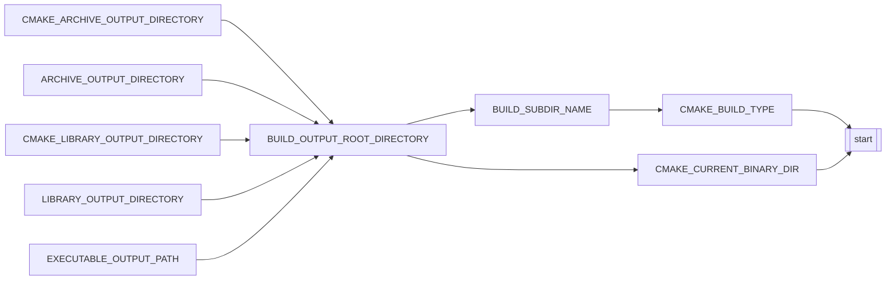
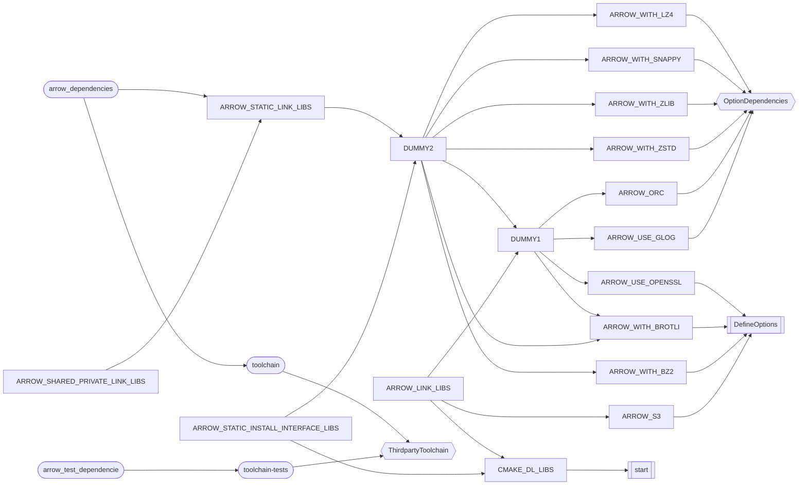

# arrowのcmakeファイルを読む

arrowのcmakeファイルを読んで変数の依存関係をまとめてみる。
読む対象は今リリースされている中で一番最新のブランチ
- [maint-0.17.x](https://github.com/apache/arrow/tree/maint-0.17.x)

として、`cpp/CMakeLists.txt`をまとめてみる。

## 概観
このファイルは一つの長いcmakeファイルになっているが、実際にはいくつかのパートに分かれている。
| 対象の行 | 内容 | ラベル |
| --- | --- | --- |
| L21-L57 | バージョン関連設定 | Version |
| L59-L141 | グローバルな変数の設定 | BuildGlobal |
| L145-L184 | ビルドオプションの設定 | BuildOptions |
| L186-L290 | 開発用のターゲット設定 | DevelopTargets |
| L292-L377 | オプション間の依存関係設定 | OptionDependencies |
| L379-L399とL455-L494 | コンパイラフラグの設定 | CompilerFlags |
| L401-L-449 | ビルド成果物のディレクトリ設定 | BuildDirectory |
| L628-L811 | リンカフラグの設定 | LinkerFlags |

以降はそれぞれのパート毎に変数の依存関係を図にしていく。

依存関係の表し方としては

という形で、ノードの形状でそれぞれの役割を分類することにしている。

## バージョン関連設定(Version)

## グローバルな変数の設定(BuildGlobal)
ここでstartはcmakeがデフォルトで生成する変数を生成するプロセス。

## ビルドオプションの設定(BuildOptions)
ここでanyが依存している変数は任意のターゲットが依存している変数であることを示す。

## 開発用のターゲット設定(DevelopTargets)
DUMMYから始まるノードはいくつかの変数をまとめるために導入したダミー変数。

## オプション間の依存関係設定(OptionDependencies)

## コンパイラフラグの設定(CompilerFlags)

## ビルド成果物のディレクトリ設定(BuildDirectory)

## リンカフラグの設定(LinkerFlags)

途中で複雑すぎて挫折。やはり何かしら別の方法で持って理解するのが良さげ。
